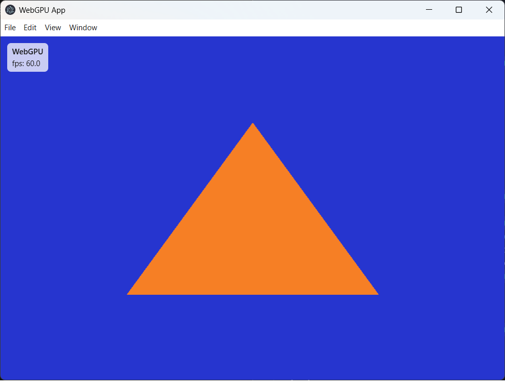

## Electron WebGPU (Triangle + FPS)

A minimal Electron + WebGPU demo. It currently renders a triangle and shows an FPS counter overlay.



## Requirements

- Node.js (npm included)
- A GPU/driver stack that supports WebGPU

Note: this project enables WebGPU in Electron via `enable-unsafe-webgpu` (see `main.js`). Support can vary by Electron version and GPU drivers.

## Install

```bash
npm install
```

## Run

```bash
npm start
```

## Project structure

- `main.js`: Electron main process (creates the window, enables WebGPU)
- `index.html`: canvas + HUD layout
- `renderer.js`: renderer entry point, initializes WebGPU pipeline
- `gpu.js`: WebGPU setup, pipeline, draw loop, FPS update
